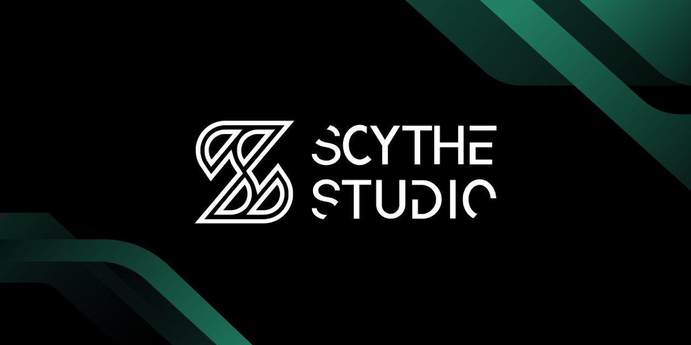
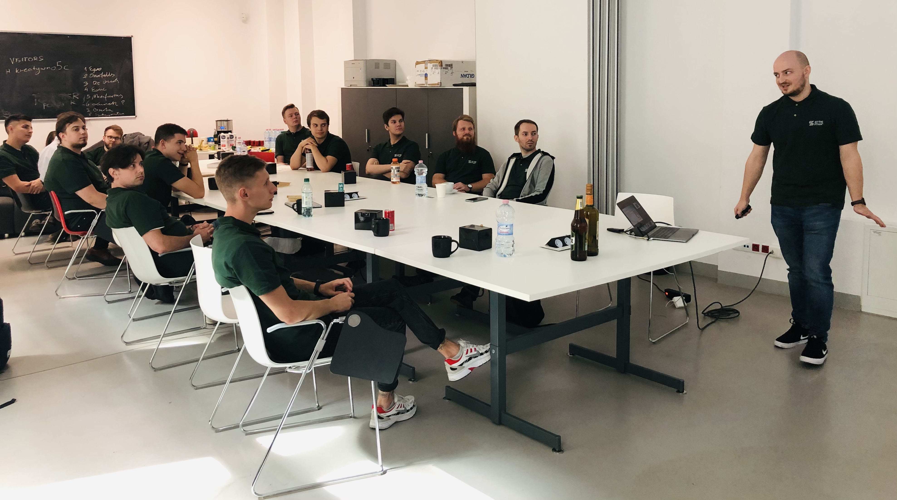

## What is Scythe Studio? 🏢

Scythe Studio company is a group of software enthusiasts for whom client satisfaction is the most crucial part of working.
Scythe Studio was created due to the growing demand for cross-platform Qt development.
Thanks to our outstanding expertise in **Qt Qml development**, we can enjoy the title of an official **Qt Service Partner**.
The company offers numerous services for clients who wish to bring their ideas to life. We have extensive and practical knowledge about various Qt modules as well as experience in using this technology in projects for clients coming from various industries. If you want to see what Scythe Studio is is capable of and what services the company is providing, click [the link](https://scythe-studio.com/en/services).

## Career at Scythe Studio  🧑‍💻

We constantly want to improve and grow as a company and individuals. If you are on the same page as we, you can give it a shot and try work with us. For more information you can check out [the link](https://scythe-studio.com/en/careers). If you don't meet our requirements you can still join our team. The company has an internship program. To see more information checkout [the link](https://scythe-studio.com/en/qt-qml-development-internship).

## What you can find here 📈 

 ### [SCodes](https://github.com/scytheStudio/SCodes)

This project is Qt & Qml wrapper for ZXing-C++ Library that is used for decoding and generating 1D and 2D barcodes. This particular C++ ZXing port is one of the most recent C++ versions of the popular ZXing library using modern compilers. The goal of this project was to create a convenient filter allowing the processing of video frames from a phone camera. 

### [Flutter vs React Native vs Qt comparison](https://github.com/scytheStudio/Flutter-vs-React-Native-vs-Qt)

### [ Example GitLab CI/CD for Qt project](https://gitlab.com/kosadev/example-gitlab-ci-cd-for-qt-project)

This project focuses on showing an example of how to set up CI/CD for a cross-platform Qt project. The application itself doesn't do anything. `.gitlab-ci.yml` and Ruby scripts placed in `targets` sub directories are what you should be concerned about.

### [NFC Demo](https://github.com/scytheStudio/NFC-Demo)

This demo presents how to use NFC for communication using the Qt framework on a mobile platform. The application has a simple UI and logic that can be an example of creative NFC usage. If you want a more in-depth look you can check out our blog post on Scythe Studio Blog.

### [Zoho Books Forecasting](https://github.com/scytheStudio/Zoho-Books-Forecasting)

Zoho Books Forecasting is a desktop application. It visualizes the financial history and makes forecasts for companies. The application utilizes the Zoho Books platform. The motivation behind the making of such an application was the inability of Zoho Books' frontend to generate a budget forecasting report.

### [QtKeyboardMonitor](https://github.com/scytheStudio/qtkeyboardmonitor)

This project was created using Qt to track keyboard usage on Windows. The app uses Windows libraries to check the state of keyboard buttons. Moreover, it also checks mouse movement. How does it work may you ask? The key state is checked every single time the timer is triggered. The timer is activated every 100ms. User activity is measured with three variables APS, APM, and avarageAps.

## Follow us  📮

Check out those links if you want to see Scythe Studio in action and follow the newest trends saying about Qt Qml development.

* 🌐 [Scythe Studio Website](https://scythe-studio.com/en/)
* ✍️  [Scythe Studio Blog Website](https://scythe-studio.com/en/blog)
* 👔 [Scythe Studio LinkedIn Profile](https://www.linkedin.com/company/scythestudio/mycompany/)
* 👔 [Scythe Studio Facebook Page](https://www.facebook.com/ScytheStudiio)
* 🎥 [Scythe Studio Youtube Channel](https://www.youtube.com/channel/UCf4OHosddUYcfmLuGU9e-SQ/featured)